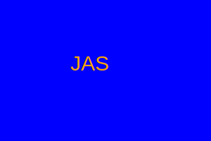

# svg-maker
This node application will dynamically create either a circle, square or rectangular svg image

## Description and Motivation
The following project is to create an application that will make SVG files. The file can contain the shapes of either a circle, square or a triangle. You will also add a color background to the shape as well as characters in the middle of it, and pick that color as well.

It should looks something like this:

I built application with the thought and understanding that people could use a graphical genterator of basic shapes and have the opertunity to add colors for the shape and letters that you might want to put in there. It can eventually be expanded to build animations, add pictures or be used on someone's profile page.

The coding here covers much of what we learned over the last week and applied so that it will be solidified in my mind.

## Usage

The way you use this Application is:
- start up a commandline prompt in the directory of the cloned application.
- Run NPM install to install any dependancies: `npm install`  // This will install packages withing the package.json file
- Then execute the app with: `node index.js`  // This is the root of the running program.
- There are also tests to be run on this project. It echecks the more important classes that build the SVG files.
- To do this, you would `cd lib; npm run test`

Here is a link to the video that was taken to show you the process I used to run this application.
[Video of SVG Generator and Usage](https://watch.screencastify.com/v/8VTWFo4wkMpBOOnFfGIJ)

## Table of Contents

* [Technology Used](#technology-used)
* [Repo Location](#repo)
* [Screenshots of Application](screenshots-of-application)
* [Learning Points](#learning-points)
* [Code Snippets](#code-snippets)
* [Contact Info](#contact-info)

## Technology Used 

| Technology Used         | Resource URL           | 
| ------------- |:-------------:| 
| Git | [https://git-scm.com/](https://git-scm.com/)     |    
| Javascript | [https://developer.mozilla.org/en-US/docs/Web/JavaScript](https://developer.mozilla.org/en-US/docs/Web/JavaScript)
| Google Search | [https://www.google.com/](https://www.google.com/)
| Stack Overflow | [https://stackoverflow.com/](https://stackoverflow.com/)
| Digital Ocean for inquirer Help| [https://www.digitalocean.com/](https://www.digitalocean.com/)
| W3Schools for JS | [https://www.w3schools.com/](https://www.w3schools.com/)
| Dev for badges | [https://dev.to/cicirello/badges-tldr-for-your-repositorys-readme-3oo3](https://dev.to/cicirello/badges-tldr-for-your-repositorys-readme-3oo3)

## Repo 

[GitHub Repo](https://github.com/flimits/svg-maker)

## Screenshots of Application
---
### main code

---
---
### Classes

---

## Learning Points 

The appliation took everthing I could put into it. Painful to learn testing. Didn't like it, but rewarding when done.

## Code Snippets
---
### Using the require statement in node.js

The fist part of the application was to learn to require packages and libraries to run it. It will not run without them.
// Include packages needed for this application
const fs = require("fs");
const inquirer = require('inquirer');
Used test wisth jest

## Contact Info

| Name      |Email      | Github    | Portfolio |
|-----------|-----------|-----------|-----------|
|Jason       |flimits@gmail.com|https://github.com/flimits|https://github.com/flimits/my-portfolio/|

## Psuedo Coding

The following is a psuedo coding practice that enables the user to plan out the way they should create this application; in a thoughtful, and visual way. It is not the code, just a framework.

- use inquirer to accept user input
Questions:  text, text color, shape, shape color
answers stores all these values
- create an svg template , and replace it with values from prompts string literls
- inside lib create a shape class that is then extended by Triangle, Circle and Square and those 3 shapes are exported.
- test for the shape class as well as the svg
- If the svg is passed a color , the svg should be of that color
how do we create svg =>
- expect(shape.render()).toEqual('<polygon points="150, 18 244, 182 56, 182" fill="blue" />');
- how do we create svg?
- we take in 4 inputs
- Shape Class needs to know what Color it is.
-   should have an attribute to store color!

* svg needs to give us a string that looks like an HTML.
* svg Class optional but could provide the svg details like color, text shape and text color.
<!-- Size is pre defined 300x200 px  -->
    Questions
    1. what text - upto 3
    2. text-color: string
    3. shape: one from list
    4. Shape color: string
Switch case to create an instance of the shape that the user wants
we modify the SVG template literas to accomodate user inputs
We write the svg file to file location using writefile
Test
tests should test
1.what functions return,
2.the classes are classes of that instance and
3.if a value is passed to class, it is set correctly.
HINT !!!   test create an SVG !!!
Check out the gitlabs folder for examples!!!

"https://watch.screencastify.com/v/8VTWFo4wkMpBOOnFfGIJ"